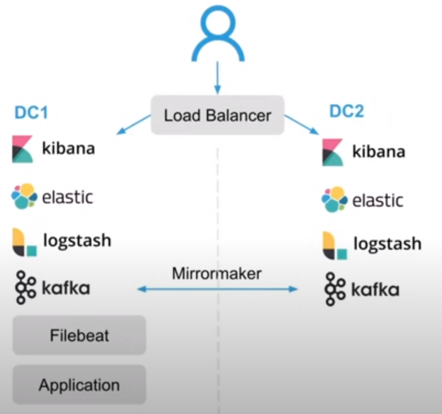

# Метрики, логирование, трейсинг.

Конспект лекции "Метрики, логирование и трейсинг" из курса «Разработчик, или от Мидла до Сеньора» от Слёрма и Райфайзен банка

https://www.youtube.com/watch?v=SvtSulGN3OU

## Ситуация и решаемые проблемы

Наша система является черным ящиком и это является проблемой потому что непонятно что внутри системы происходит.
Имеются следующие риски:
- Нас взломали - мы не узнали.
- У нас сломался сервис - нам об этом сообщили клиенты, пользующиеся системой, теряем деньги, система стоит.
- Невозможность развивать систему не зная сколько и когда нам нужно ресурсов.

Чтобы избежать этих рисков, необходимо сделать систему "прозрачной" или по-другому "наблюдаемой" (Observability).

Три кита Observability:
1. Метрики
2. Логи
3. Трейсинг

Метрики - это числовые данные, которые генерируются системой, типа загрузи процессора, потребляемая память, объем траффика и т.п.
Логи - текстовый поток описания событий происходящих внутри системы.
Трейсинг - последовательная запись всех вызовов которые происходят в системе

### Метрики

Чтобы начать собирать метрики, их нужно как то сгенерировать и куда-то положить.
Составные части системы метрик:
1. Источник метрик
2. Коллектор метрик
3. Хранилище метрик
4. UI для просмотра
5. Оповещения

Существующие решения:

#### Zabbix + Graphite + Grafana
1,2 - Zabbix agent

3 - Graphite

4 - Grafana

5 ---

#### Tick stack
1,2 Telegraf

3 - InfluxDB

4 - Grafana

5 - Chronograf

#### Prometheus (самый современный) от Sound Cloud 
1 - Exporter

2-3 - Prometheus

4 - Grafana

5 - Alert Manager

##### Экспортеры в стеке Prometheus
Их много, основные:
- Node exporter  - для системных метрик
- Blackbox exporter (если не можем инстанцировать сервис), это механизм получения метрик снаружи использует механизм "probe"
- Statsd exporter, почти то же самое что и "Black box" 
- JMX - exporter для Java
- и т.п.

Виды метрик:
- Counter (Счетчик). Типа счетчика посещений или кол-ва переданных байт, основной признак - монотонно возрастающие по времени метрики
- Gauge (Шкала). Для метрик которые могут монотонно изменяться со временем как в большую так и в меньшую сторону, типа CPU, используемая память и т.п.
- Histogram (Гистограмма). Для изменения какого-то параметра в течение определенного промежутка времени.
- Summary (Сводка). Как гистограмма, но может еще и рассчитывать квантили для скользящих интервалов.

Для метрик используют промышленный стандарт OpenMetrics

Хотим еще и собирать бизнес метрики.

Основные принципы метрик для бизнеса:
1. RED подход - хорошо подходит для HTTP
 - Rate - кол-во запросов
 - Errors - кол-во ошибок при этих запросах
 - Duration - длительность запросов

2. USE подход (для железа или микросервисов по очередям)
 - Utilization
 - Saturation (Насыщение)
 - Errors
Например: есть сервис который оттестирован на нагрузочном тесте, и мы знаем что на 1000 запросов в секунду он работает нормально, а на 1100 уже нет, чтобы вовремя масштабировать сервис

3. Four gold signals (от гугла)
 - Latency (Задержка)
 - Traffic
 - Errors
 - Saturation (Насыщение)

### Логирование
Логирование - это запись **текстовых** данных о событиях, которые происходят в приложении

Есть два вида логов
- Критические - логи ~~при которых программа должна упасть если не может положить в лог~~ которые обязательно нужно сохранять
- Не критические (нет так нет)

Для критических логов стоит использовать отложенный лог, например через Kafka

Для логов предусмотрены несколько видов доставки:
 - Напрямую. Например, через библиотеку в хранилище.
 - Пишем в syslog, потом кто-то читает и анализирует (Log shipper)
 - В файл, потом кто-то читает и анализирует (Log shipper)
 - STDOUT/STDERR (согласно 12 факторам cloud native приложений), потом log shipper

Проблемы логов (типичные боли):
 - Multiline (многострочные)
 

Эволюция логов в приложении:

Этап 1. Старт разработки
Application -> Graylog
Проблемы:
 - нагрузка
 - встроенное ограничение на показ логов в community editions

Этап 2. Растем
Application -> Elastic Search Cluster
Проблемы:
- не стоит слать данные в эластик напрямую
- можно потерять данные
- можно завалить кластер запросами
- можно потерять доступность нашего приложения???

Этап 3. Растем и пытаемся решить проблемы этапа 2
Application -> File Beat -> Elastic Search Cluster
Проблемы:
- по-прежнему можно завалить кластер запросами

Этап 4. Растем и пытаемся решить проблемы этапа 3
Application -> File Beat -> Log Stash Cluster -> Elastic Search Cluster
Проблемы:
- Пиковые нагрузки с которыми может не справится Log Stash Cluster

- Этап 5. Растем и пытаемся решить проблемы этапа 4
Application -> File Beat -> Kafka -> Log Stash Cluster -> Elastic Search Cluster
Уже сть определенные гарантии отказоустойчивости, но много ступеней - есть риск отказа в случае отказа одной из них

- Этап 6. К чему пришли:

#### Алертинг
Не стот делать алертинг по логам - т.к. нет гарантии доставки.

### Трейсинг

Промышленный стандарт - OpenTracing

Условия необходимые для сбора трейсинга:
1. Точка входа умеет дописывать заголовки.
2. Приложение должно уметь работать с заголовками (для дальнейшего прокидывания заголовков).

Существующие решения: 
- Jaeger + Elastic - бесплатно
- Elastic APM - платно

Проблемы 
- Требуется инструментироавние приложения.
- Требуется поддержка со стороны инфраструктуры.
- На большом объеме трейсы очень дорогие (latency, много данных), решение для этого <a href="https://ru.wikipedia.org/wiki/%D0%A1%D0%B5%D0%BC%D0%BF%D0%BB%D0%B8%D1%80%D0%BE%D0%B2%D0%B0%D0%BD%D0%B8%D0%B5_(%D0%BC%D0%B0%D1%82%D0%B5%D0%BC%D0%B0%D1%82%D0%B8%D1%87%D0%B5%D1%81%D0%BA%D0%B0%D1%8F_%D1%81%D1%82%D0%B0%D1%82%D0%B8%D1%81%D1%82%D0%B8%D0%BA%D0%B0)">сэмплирование</a>.
- Практически безальтернативны для микросервисов.
 
Sentry - решение для разработчика для трейсинга

Все это использует две модели Push или Pull

Полезные ссылки:

https://landscape.cncf.io/card-mode?category=observability-and-analysis&grouping=category
https://www.robustperception.io/blog - про Prometheus стек
https://www.weave.works/blog/the-red-method-key-metrics-for-microservices-architecture/ - про бизнес метрики RED
https://www.brendangregg.com/usemethod.html - про бизнес метрики USE
https://sre.google/sre-book/monitoring-distributed-systems/ - мониторинг распределенных систем
https://t.me/mertics_ru - канал телеграм

